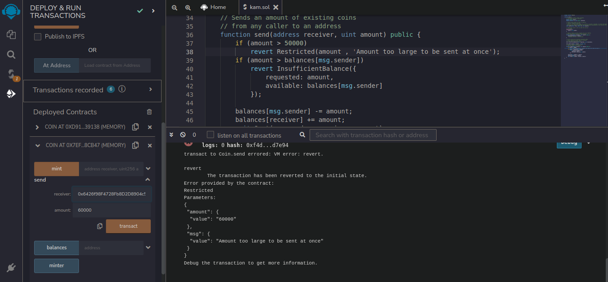

# Smart Contract "Coin Modified Version"

#### With the help of this smart contract u can send coins to other people, The contract allows anyone to mint new coins.
Anyone can send coins to each other without the need of registering (with a username and password) all u need is a ethereum keypair.

</img>

Funtions in the smart contract
- mint: With this function we can mint coins by adding address and amount. 
- send: With this function we can send coins to other person (we need to add the receivers account address and the amount we want to send)
- balance: This function shows the balance of an account (if u input the address of the sender or the receiver u will get there account balance).
- minter: This function shows the minter i.e owners address.

Modified Functionalities 
- Anyone can mint through this smart contract
- There is a restriction imposed on the numeber of coins that can be sent in one go.
