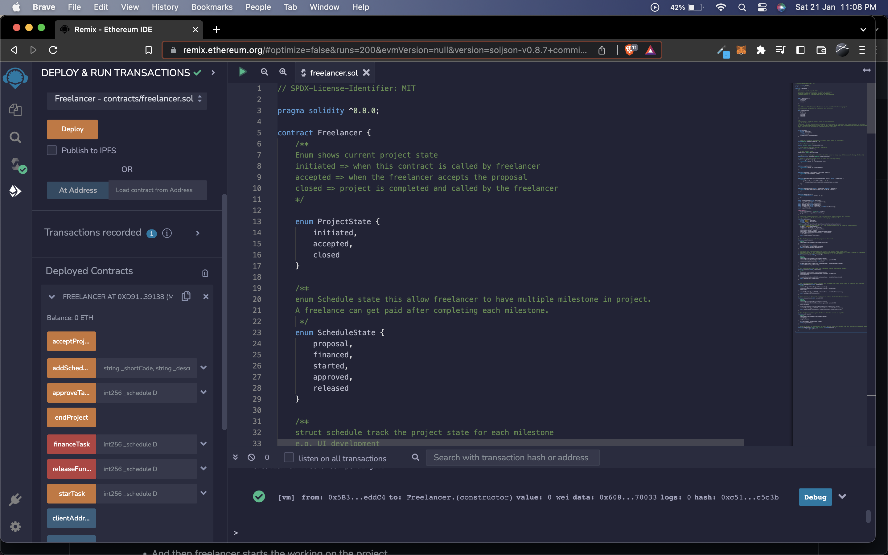

# Freelancer Smart Contract

A basic freelancer script in Solidity.

A project follows the following steps:
* This contract is initiated by the freelancer.
* Then the project receives acceptance from the client.
* And then freelancer starts the working on the project.

## Brief introduction about the code (also see comment in the contract)

1. `addSchedule()` this function takes three argument `shortCode`, `description` and `amount` and adds the project to the schedule.
2. `acceptProject()` after the proposal freelancer can agree with client and accepts the project.
3. `financeTask()` this function takes `int256` type schedule id for marking the project as financed from `scheduleRegister` it only marks the each stage.
4. `startTask` this function takes `int256` type schedule id for marking the project as started from `scheduleRegister` it marks that project is started for the given stage.
5. `approveTask` this function takes `int256` type schedule id for marking the project as approved from `scheduleRegister` it marks that project is approved for the given stage and only called by the client.
6. `releaseFunds` this function takes `int256` type schedule id for releasing the funds from `scheduleRegister` can called after project is accepted and approved by the client.

 ### Sreenshot of the Programme, 
 
 [Video for complete working](https://drive.google.com/file/d/1o-v5VjWltOMQ5XrQCyCGYlMXGepP-6L9/view)