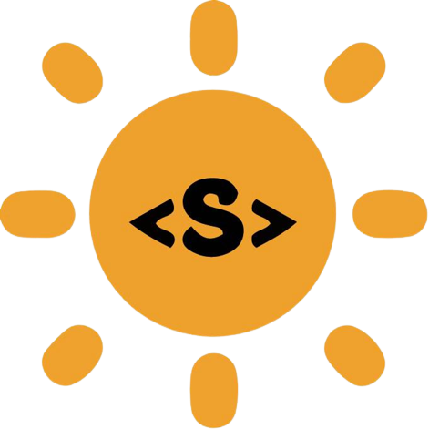

[](https://gitpod.io/#https://github.com/Vikash-8090-Yadav/Solidity-Pathshala)
# <p align = "center"> Solidity-Pathshala </p>
<br>


<br> 

 <div align="center">
 <p>

[](https://github.com/ellerbrock/open-source-badges/)


  


 </p>
 </div>
 
## 📌 Open Source Program</h2>

### This project is a part of following Open Source Programs</h2>


<div align="center" >

 
 
 
 &nbsp; &nbsp; &nbsp;
   
</div>

##  About Solidity-Pathshala

The one place for smart contract developers to showcase their ideas and code. This repo will have all the smart contract written in the remix IDE. It contains all the source code with the screen shot.
  
## How to Contribute?

- Take a look at the existing [Issues](https://github.com/ssurbhi09/Github-Automation/issues) or [create a new issue](https://github.com/Vikash-8090-Yadav/Solidity-Pathshala/issues/new)!
- [Fork the Repo](https://github.com/Vikash-8090-Yadav/Github-Automation/issues/new/fork), create a branch for any issue that you are working on and commit your work.
- Create a **[Pull Request](CodingEasy)** (_PR_), which will be promptly reviewed and given suggestions for improvements by the community.
- Add screenshots or screen captures to your Pull Request to help us understand the effects of the changes that are included in your commits.

## How to make a Pull Request?

**1.** Start by making a fork the [**Solidity-pathshala**](https://github.com/Vikash-8090-Yadav/Solidity-Pathshala) repository. Click on the <a href="https://github.com/Vikash-8090-Yadav/Solidity-Pathshala/fork"></a> symbol at the top right corner.

**2.** Clone your new fork of the repository:

```bash
git clone https://github.com/<your-github-username>/Solidity-Pathshala
```

**3.** Navigate to the new project directory:

```bash
cd Solidity-Pathshala
```

**4.** Set upstream command:

```bash
git remote add upstream https://github.com/Vikash-8090-Yadav/Solidity-Pathshala.git
```

**5.** Create a new branch:

```bash
git checkout -b YourBranchName
```

**6.** Sync your fork or local repository with the origin repository:

- In your forked repository click on "Fetch upstream"
- Click "Fetch and merge".

### Alternatively, Git CLI way to Sync forked repository with origin repository:

```bash
git fetch upstream
```

```bash
git merge upstream/main
```

### [Github Docs](https://docs.github.com/en/github/collaborating-with-pull-requests/addressing-merge-conflicts/resolving-a-merge-conflict-on-github) for Syncing

**7.** Make your changes to the source code.

**8.** Stage your changes and commit:

⚠️ **Make sure** not to commit `package.json` or `package-lock.json` file

⚠️ **Make sure** not to run the commands ```git add .``` or ```git add *```. Instead, stage your changes for each file/folder

```bash
git add file/folder
```

```bash
git commit -m "<your_commit_message>"
```

**9.** Push your local commits to the remote repository:

```bash
git push origin YourBranchName
```

**10.** Create a [Pull Request](https://help.github.com/en/github/collaborating-with-issues-and-pull-requests/creating-a-pull-request)!

**11.** **Congratulations!** You've made your first contribution! 🙌🏼

</br>

### How to Setup Locally 

**1.** Follow the [PR STEPS](https://github.com/Vikash-8090-Yadav/Solidity-Pathshala#how-to-make-a-pull-request) , after   cloning repo in your local system 


**2.** You  can copy  and pate the code in the Remix ide https://remix.ethereum.org/


**3.** If u don't know how to use the remix check this , [How to use Remix Ide ](https://github.com/Vikash-8090-Yadav/Solidity-Pathshala/blob/main/Blog/How%20to%20use%20remix%20IDE/How%20to%20use%20remix.ide.md)


**4.** Congratulations 🙌🏼 , You have setup the Solidity programme in your PC ,It's time to check the code and Raise a PR 

## Project Admin

<table>
<tr>
<td align="center"><a href="https://github.com/Vikash-8090-Yadav"></a></br> <h4 style="color:red;">Vikash Kumar Yadav</h4>
<a href="https://www.linkedin.com/in/vikash-kumar-yadav-8090/"></a>
   </td>

</tr>
</table>

## Project Contributors

<a href="https://github.com/Vikash-8090-Yadav/Solidity-Pathshala/graphs/contributors">

</a>

<p align = "center">
Show some ❤️&nbsp; by giving  to this repo
</p>
